```{r setup, include=FALSE}
knitr::opts_chunk$set(echo = FALSE)
knitr::opts_chunk$set(eval = FALSE)
```

## Outline  

- Introduction

- Git \& Github

- RStudio

- RMarkdown

- _site.yml

- index.Rmd

- Other Webpages

- Customizations

- Getting Started

# Introduction

## Introduction

- Building a personal website is a good way to display your accomplishments

- Using both RMarkdown and GitHub, you can create your own personal website from static web pages

- RMarkdown allows you to create static websites with very little programming

## Examples

```{r, eval = TRUE}
knitr::include_url("https://www.inqs.info/")
```

## Examples

```{r, eval = TRUE}
knitr::include_url("https://rmarkdown.rstudio.com/")
```


# Git & GitHub

## Git

- Git is a version control software that track your changes in your code.

- It is similar to "see changes" to Google Docs, but for code

- We will use to deploy your website to Github

- Terminology

    - add: add file to list that needs to be saved

    - commit: save list of files
    
    - clone: copy a repository (folder)
    
    - push: upload changes to Github (or other websites)
    
    - pull: download changes from Github

## Git Installation

[https://git-scm.com/book/en/v2/Getting-Started-Installing-Git](https://git-scm.com/book/en/v2/Getting-Started-Installing-Git)

- Windows

    - Download and install aplication

- Mac

    - Download and install aplication

    - Commandline
    
```{r, eval=FALSE, echo=TRUE}
git --version
```

- Linux

```{r, eval=FALSE, echo=TRUE}
sudo apt/dnf install git
```

## GitHub

- GitHub can be thought as the Google Drive for code

- GitHub allows you to host a static personal website with html and markdown files

- Contains version control


## GitHub Pages 

- GitHub pages allow you host a static website

- Set up is easy

- Additionally, GitHub will host a pre-built website from a repository

  - The website must be located in the `docs` folder

- Must create repo as USERNAME.github.io
  

# RStudio

## RStudio

- RStudio is an Integrated Development Environment (IDE) that organizes your R environment

- It contains 4 panes that organizes your editors, consoles, environment, plots and more

- It allows execution of your R code for data exploration

- It is free to download and install on any computer

- Visit their website for more information: [rstudio.com](https://www.rstudio.com/)

## RStudio

- RStudio is integrated with git to quickly push updates to GitHub

- RStudio can build websites eliminating the need to render from other services

# RMarkdown

## RMarkdown

- RMarkdown is a special file format that allows you to create documents

- RMarkdown can be rendered into numerous different file formats:

    - Documents
        - HTML
        - PDF
    - Slides
        - slidy
        - ioslides
        - xaringan
    - Applications
        - Shiny
    - Books
    - Websites
    
- Given all its capabilities, I believe RMarkdown(Markdown) is the future!
        
    

# _site.yml

## _site.yml

- This file controls the contents in your website.

- It is based on a YAML file

    - Contains url information
    
    - Controls your menu options
    
    - Controls customizations
    
    - Controls output

# index.Rmd

## index.Rmd

- The index.Rmd file contains the information for your homepage

- Add a basic introduction about you

# Other Webpages

## Other Webpages

- To include other web pages, create an Rmd file and select `html_document` as its output

  - Add any other relevant information to the yaml header as needed
  
- Write text to the document as you would with any other Rmd file

## Navbar

- Any webpages you created need to be easily accessed from your website

- The navbar is the best place to access

- Add your webpages in the navbar section of your _site.yml file 

## Education.Rmd

- Add information about your education.

- Include any summer educational programs you participated in

## Links.Rmd

- Add links to other profiles about you
  
  - LinkedIn
  
  - Handshake
  
  - Portfolium
  
  - Resume/CV
  
  - Researchgate
  
  - Academia.edu
  
  - Other Websites
  
## Github

- You may be interested in displaying your GitHub profile separately from your Links.Rmd file

- You can place a link in the navbar and use the GitHub logo as the button

- Add the following code to the navbar section of the _site.yml file

```{r, eval=FALSE, echo=TRUE}
    - icon: fab fa-github fa-lg
      href: https://github.com/USERNAME
```

# Customizations

## Changing themes

- default

- cerulean

- journal

- flatly

- readable

- spacelab

- united

- cosmo

- lumen

- paper

- sandstone

- simplex

- yeti


## Changing themes

Add the following lines to your _site.yml file

```{r, eval=FALSE, echo=TRUE}
output:
  html_document:
    theme: cerulean
```

## Customizing Appearances

- Use a css file to further customize your website

  - Change appearance
  
  - Add components to your website

  - Best way is to change a variable and see what changes
  
  - Include in _site.yml to incorporate css file
  
  
```{r, eval=FALSE, echo=TRUE}
output:
  html_document:
    css: styles.css
```
  

## Custom Domain Name

- Using Github, your domain name is set as USERNAME.github.io

- However, you can register a domain for a yearly price

- Prices are dependent on domain ending (.com, .org, ...)

# Thank You

# Getting Started

## Goal

The goal is to create a website similar to this:

```{r, eval = TRUE}
knitr::include_url("https://inqs909.github.io/")
```


## Installation

- Install R

    - [https://cloud.r-project.org/](https://cloud.r-project.org/)
    
- Install git

    - [https://git-scm.com/book/en/v2/Getting-Started-Installing-Git](https://git-scm.com/book/en/v2/Getting-Started-Installing-Git)
    

- Install RStudio

    - [https://www.rstudio.com/products/rstudio/download/#download](https://www.rstudio.com/products/rstudio/download/#download)

- Install R Packages

```{r, echo=TRUE}
install.packages("rmarkdown")
```


## GitHub

- Create a GitHub Account

    - [https://github.com/](https://github.com/)
    
- Create Repository

    - USERNAME.github.io


## GitHub

Click on New

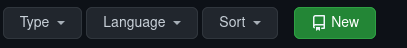

## Github

Add Repo name: USERNAME.github.io

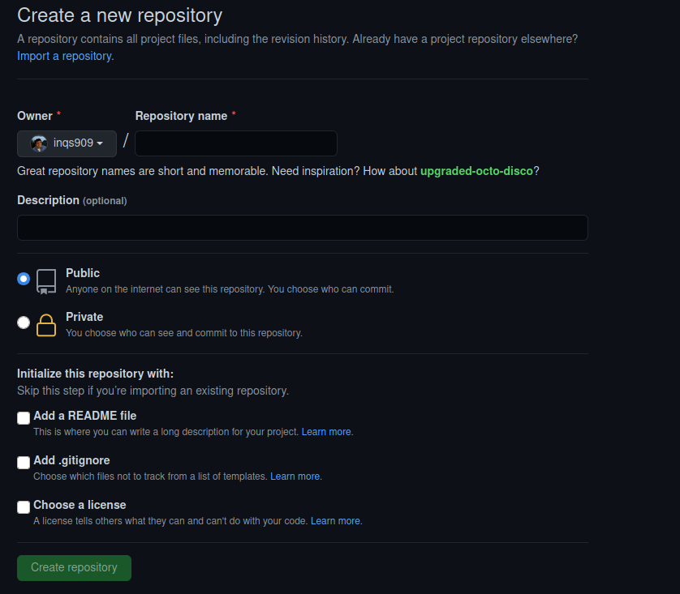


## RStudio

- Create an R project

    - Call it USERNAME.github.io
    

## RStudio

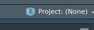

## RStudio

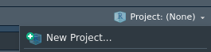

## RStudio

Select New Directory

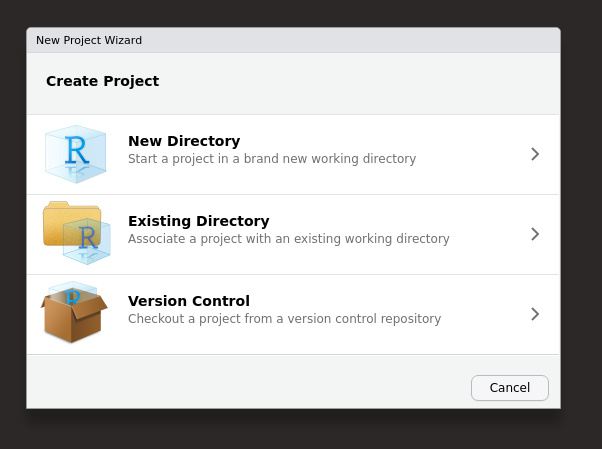

## RStudio

Choose Simple R Markdown Website

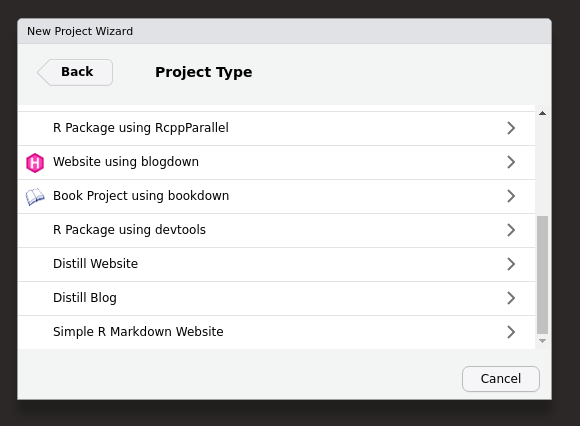


## RStudio

Name Project

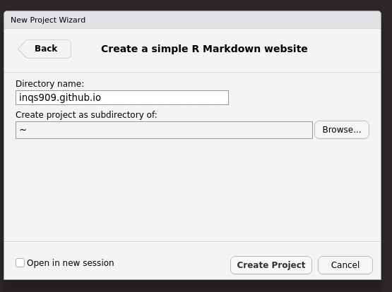

## RStudio

Run the following code:

```{r, eval=FALSE, echo=TRUE}
file.remove("about.Rmd")
file.remove("_site.yml")
file.create('.nojekyll')
download.file("https://www.inqs.info/files/example_site.yml", "_site.yml")
download.file("https://www.inqs.info/files/education.Rmd", "education.Rmd")
download.file("https://www.inqs.info/files/teaching.Rmd", "teaching.Rmd")
download.file("https://www.inqs.info/files/research.Rmd", "research.Rmd")
download.file("https://www.inqs.info/files/styles.css", "styles.css")
```


## RStudio

Change _site.yml

```{r, echo =TRUE}
name: "WEBSITE_NAME"
title: "WEBSITE_NAME"
base_url: https://www.example.com
```

to

```{r, echo =TRUE}
name: "WEBSITE_NAME"
title: "WEBSITE_NAME"
base_url: inqs909.github.io
```


## RStudio

Build your website

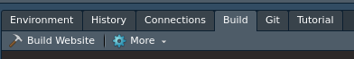

## RStudio

Point to GitHub

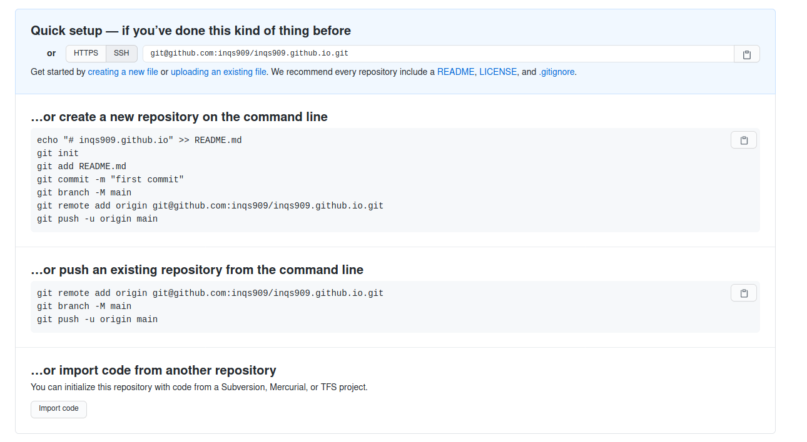{width=90% }

## RStudio

Point to GitHub

Type in Terminal Tab:

```{r, echo=TRUE}
git init
git add .
git commit -m "first commit"
git remote add origin git@github.com:inqs909/inqs909.github.io.git
git branch -M main
git push -u origin main
```

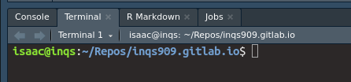{width=90% }

It may ask for your username and password.

## GitHub

Go to Repo page and then Settings

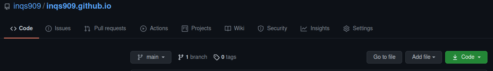{width=90% }


## GitHub

Select Pages

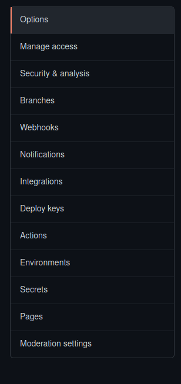{width=30% }

## GitHub

Should look something like below:

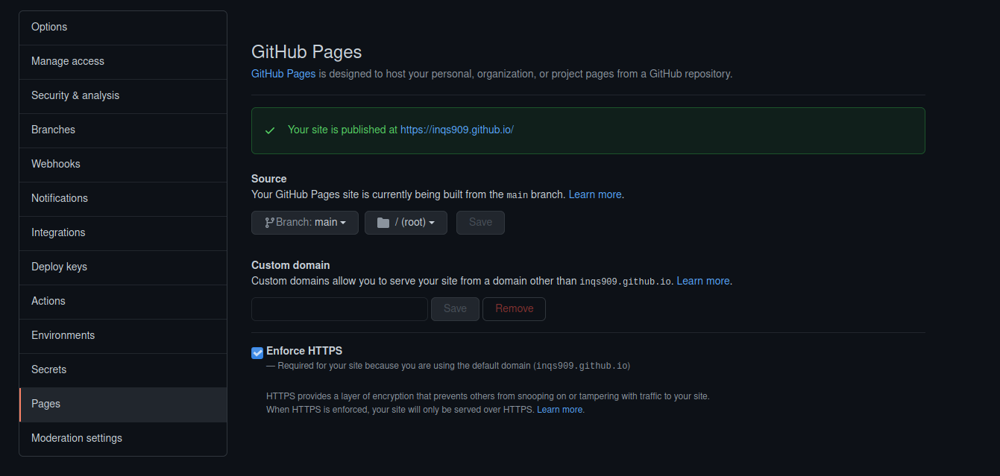{width=90% }

## GitHub

In Source Section, change (root) to docs, then save

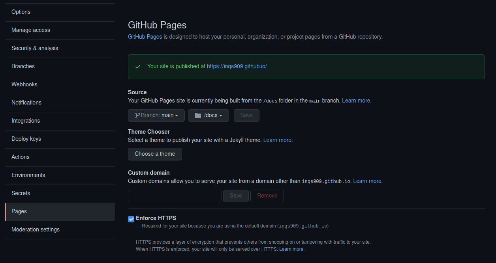{width=90% }

## GitHub

Click on link and go to website

```{r, eval = TRUE}
knitr::include_url("https://inqs909.github.io/")
```

# Updating Website

## Updating Website

- Update a website by changing the Rmd files as needed

- Add new web pages by creating new Rmd files

- Alter the look of the website by changing the css or _site.yml file

## Updating Website

Once you made all the changes, build the website as before


## Updating Website

Then push all the new changes to GitHUb

```{r, echo=TRUE}
git add .
git commit -m "Updating Website"
git push 
```

It will take Github a few moments to implement the changes

# Other Website Engines

## Distill

- Distill is an r package that allows you to create website specifically for scientific writing and communication.

- Can create websites containing articles

- Can create blogs that require more programming


## Bookdown

- Bookdown allows you to knit a collection of RMD articles to an ebook

- Good for mathematical and programming books

- Can be extended to other sciences


## Blogdown

- Blogdown is considered as the swiss army knife of R website building 

- Built on the Hugo Engine

- Extremely powerful for customization

- Extremely difficult to implement if you don't know what your doing

- Little to no tutorials

# Resources

## Resources

- RMarkdown

    - [https://bookdown.org/yihui/rmarkdown/](https://bookdown.org/yihui/rmarkdown/)

- Website Guide

    - RMarkdown [https://livefreeordichotomize.com/2017/08/08/how-to-make-an-rmarkdown-website/](https://livefreeordichotomize.com/2017/08/08/how-to-make-an-rmarkdown-website/)

    - Bookdown [https://bookdown.org/yihui/bookdown/](https://bookdown.org/yihui/bookdown/)
    
    - Distill [https://rstudio.github.io/distill/](https://rstudio.github.io/distill/)
    
    - Blogdown 
        - [https://bookdown.org/yihui/blogdown/](https://bookdown.org/yihui/blogdown/)
        
        - [https://www.andreashandel.com/post/blogdown-website-1/](https://www.andreashandel.com/post/blogdown-website-1/)
        
- Netlify

    - [https://www.netlify.com/](https://www.netlify.com/)
    
