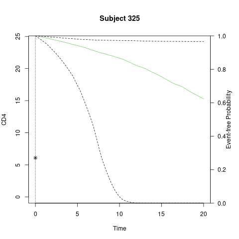

```{r setup, include=FALSE, cache=TRUE}
knitr::opts_chunk$set(
  cache = FALSE,
  echo = FALSE,
  message = FALSE, 
  warning = FALSE,
  fig.show = TRUE)

library(survival)
library(nlme)
library(JMbayes)
library(DT)

me <- lme(CD4 ~ obstime + obstime:drug,
          random = ~ obstime | patient, 
          data = aids)


ph <- coxph(Surv(Time, death) ~ drug,
            data = aids.id,
            x=TRUE)
jm.1 <- JMbayes::jointModelBayes(me, ph, timeVar = "obstime")
fp <- aids[aids$patient==325,]
surv_fp <- JMbayes::survfitJM(jm.1, fp, idVar = "patient")

```


```{r rpacks, include=FALSE}
library(survival)
library(nlme)
library(JMbayes)
library(DT)
```


```{r, load_refs, include=FALSE, cache=FALSE}
library(RefManageR)
BibOptions(check.entries = FALSE,
           bib.style = "authoryear",
           cite.style = "authoryear",
           style = "markdown",
           hyperlink = FALSE,
           dashed = FALSE,
           no.print.fields=c("doi","issn"))
mybib <- ReadBib("./MyBib.bib", check = FALSE)
```


## Outline

--

- [Joint Longitudinal-Survival Models](#jm)

    - Joint Density Function
    
    - Model Specification
    
    - Likelihood Formulation
    
    - Estimation

--

- [Dynamic Predictions of Joint Models](#dp)

--

- [Applications in R](#ar)


---
name: jm
class: middle, inverse
# Joint Longitudinal-Survival Models
---
## Overview

- Many biomedical studies collect repeated measurements from a participant until they experience an event

???

Then in 1997 Wulfsohn and described the shared-parameter model to model the dependent outcomes.

Further, The shared-parameter became the standard model to analyze longitudinal-survival data

--

- Given the available data, researchers may be interested in the association between the repeated measurements and time-to-event

--

-  `r TextCite(mybib["degruttolaModellingProgressionCD4Lymphocyte1994"])` and `r TextCite(mybib["tsiatisModelingRelationshipSurvival1995"])` proposed different models to characterize the association  

--

- `r TextCite(mybib["wulfsohnJointModelSurvival1997"])` proposed the shared-parameter model to jointly model the dependent outcomes


---

## Data Types

???

Before we go any further, let's briefly discuss the different data types.

With these two data types, we can further dive to the shared-parameter model.


--

.pull-left[
### Longitudinal Data

* Longitudinal data is the collection of repeated measurements from a participant at different time points

* Two methods to analyze repeated measurements:
    
    + General Least Squares
    
    + Linear Mixed Effects Models
]

--

.pull-right[

### Survival Data

- Survival data is the time for a participant to experience a desired event

* Cox Proportional Hazard Model `r Citep(mybib["coxRegressionModelsLifeTables1972"])` 
 is used to model the association between the time-to-event and a set of predictors

]

---

## Shared-Parameter Model

- The shared-parameter model utilizes two separate submodels for each outcome

- Each submodel shares a set of random effects 

- The random effects induce the correlation between the outcomes `r Citep(mybib["tsiatisJointModelingLongitudinal2004"])`

???

Further the shared-parameter model has been extended for different data types:

With these details in mind, let's talk about how the models are formulated and estimated.

--

- The shared-parameter has been extended for

    - Heirarchical Data `r Citep(mybib["liuJointAnalysisMultilevel2008"])`
    
    - Generalized Outcomes `r Citep(mybib[c("larsenJointAnalysisTimetoEvent2004","liRobustJointModeling2009","rizopoulosTwoPartJointModel2008")])`


---
## Data

With $n$ participants, each $i^{th}$ participant has: 

???


To begin let's define our data:

for each participant, they have

n_i measurements at t_i timepoints, at each time point, data is collected for the longitudinal outcome and a set of predictors.

Using this data framework, let's talk about how we can jointly model these dependent outcomes. To begin, let's talk about the density function.

--

.pull-left[
### Longitudinal Data

- $n_i$ repeated measurements

- $t_{i}=(t_{i1}, t_{i2}, \cdots, t_{in_i})^\mathrm T$

- $Y_i=(Y_{i1}, Y_{i2}, \cdots, Y_{in_i})^\mathrm T$

- $X_{ij}=(X_{ij1}, X_{ij2}, \cdots, X_{ijk})^\mathrm T$

]

--

.pull-right[
### Survival Data

- $T_i$: Observed time

- $\delta_i$: Censoring status

]


---

## Joint Density Function
For an $i^{th}$ individual:

$$P(T_i, \delta_i, \boldsymbol Y_i; \boldsymbol \theta)$$
???
Using this data framework, let's talk about how we can jointly model these dependent outcomes. To begin, let's talk about the density function.

For an $i^{th}$ individual, we are interested in the joint density function of the two outcomes, T_i and Y_i. However, due to the outcomes being dependent with each other, we cannot multiply the density functions together. Instead we incorporate random effects to account for the correlation. When we do, the outcomes are conditionally independent of each other given the random effects. This will in turn allow us to multiply the density functions together. 

To formulate the joint density function, let's talk about the submodels for each outcome.

--

$$\begin{eqnarray}
P(T_i, \delta_i, \boldsymbol Y_i; \boldsymbol \theta) &=& \int  P(T_{i},\delta_{i}|b_{i};\boldsymbol \theta)P(\boldsymbol Y_{i}|b_{i};\boldsymbol \theta)P(b_{i};\boldsymbol \theta) db_i\\
& = & \int  P(T_{i},\delta_{i}|b_{i};\boldsymbol \theta) \prod^{n_i}_j P(\boldsymbol Y_{ij}|b_{i};\boldsymbol \theta)P(b_{i};\boldsymbol \theta) db_i
\end{eqnarray}$$
--

- The random effects account for the correlation between the repeated measurements and time-to-event

- The outcomes are conditionally independent of each other


---
## Longitudinal Submodel

???

Our longitudinal outcome y can be represented in 2 components: a linear model and an error term. The linear model m i is a mixed effects model where...

A couple assumptions are that the random effects are normally...

and the error term follows a normal ...

--

$$\Large{Y_{ij} = m_i (t_{ij}) + \epsilon_i(t_{ij}),}$$
--

where

.pull-left[
- $m_i(t_{ij})=\boldsymbol{X}_{ij}^\mathrm T\boldsymbol \beta + \boldsymbol Z_{ij}^\mathrm Tb_i$

- $\boldsymbol X_{ij}$: design matrix

- $\boldsymbol \beta=(\beta_1,\cdots,\beta_p)^\mathrm T$: regression coefficients

- $b_i \sim N_q(\boldsymbol 0, \boldsymbol G)$

].pull-right[
- $\epsilon_i(t_{ij})$: error term at time $t_{ij}$

- $\boldsymbol Z_{ij}$: subset of $\boldsymbol X_{ij}$

- $b_i=(b_{i1},\cdots,b_{iq})^\mathrm T$: random effects

- $\epsilon_i(t_{ij}) \sim N(0, \sigma²)$
]


---

## Survival Submodel - Hazard Function

???

The hazard function is the probability that the event will occur in the next moment given it has not occurs thus far. This can be represented with a proportional hazard model.

--

$$\large{\lambda_i\{t|M_i(t),X_i\}=\lim_{\Delta\rightarrow 0}\frac{ P\{t\leq T_i <t+\Delta|T_i\geq t, M_i(t),\boldsymbol X_{i1}\}}{\Delta}}$$
$$\large{\lambda_i\{t|M_i(t),\boldsymbol X_{i1}\}=\lambda_0(t)\exp\{\boldsymbol X_{i1}^\mathrm T\boldsymbol \gamma+\alpha m_i(t)\}}$$

--

where 

- $\lambda_0(t)$: baseline hazard function
- $\boldsymbol X_{i1}$: design matrix at first time point
- $\boldsymbol \gamma$: regression coefficients
- $\alpha$: association coefficient
- $M_i(t)$: history of the longitudinal outcome


---

## Probability Formulation


$$P(T_{i},\delta_{i}|b_{i};\boldsymbol \theta)P(\boldsymbol Y_{i}|b_{i};\boldsymbol \theta)P(b_{i};\boldsymbol \theta)$$
.scrollable-65[

where

$$\begin{aligned} P(\boldsymbol Y_i|b_i;\boldsymbol \theta)P(b_i;\boldsymbol \theta) = & \prod_{j=1}^{n_i}\frac{1}{\sqrt{2\pi \sigma²}}\exp\left[-\frac{1}{2\sigma²}\left\{Y_{ij}-(\boldsymbol{X}_{ij}^\mathrm T\boldsymbol \beta + \boldsymbol Z_{ij}^\mathrm Tb_i)\right\}^2\right] \\
\times & (2\pi)^{-q/2}|G|^{-1/2}\exp\left(-\frac{1}{2}b_i
^\mathrm T G ^{-1}b_i\right)\end{aligned}$$
$$\begin{eqnarray}
P(T_{i},\delta_{i} |b_{i};\boldsymbol \theta)&=& \lambda_{i}(T_{i})^{\delta_{i}} S_{i}(T_{i})\notag\\
&=&\left[\lambda_0(T_{i})\exp\left\{\boldsymbol X_{i1}^\mathrm T\boldsymbol \gamma+\alpha m_i(T_i)\right\}\right]^{\delta_{i}}\notag\\
& & \times \exp\left[-\int^{T_{i}}_0\lambda_0(s)\exp\{\boldsymbol X_{i1}^\mathrm T\boldsymbol \gamma+\alpha m_i(s)\}ds\right]\\ \end{eqnarray}$$


- $\boldsymbol \theta=\{\boldsymbol \beta^\mathrm T,\alpha,\boldsymbol \theta_{\lambda_0}^\mathrm T,\boldsymbol \theta_{b}^\mathrm T, \sigma²\}^\mathrm T$
- $S_i(\cdot)$: survival function
- $\boldsymbol \beta,\alpha$: regression coefficients
- $\boldsymbol \theta_{\lambda_0}$: baseline hazard function parameters
- $\boldsymbol \theta_{b}$: random effects parameters

]


???
Given the submodels, we can then define the conditional probability for each outcome.

The Longitudinal outcome and random effects are represented with the normal density function

The conditional density function for the survival outcome is represented as the product of the hazard function and the survival function.
---
## Likelihood Formulation

$$\begin{eqnarray}
\ell(u,\boldsymbol \theta) & = & \sum^n_{i=1}\ell_i(b_i,\boldsymbol \theta)=\sum^n_{i=1}\log P(T_{i},\delta_{i},\boldsymbol Y_{i},b_{i};\boldsymbol \theta) \\
\log P(T_{i},\delta_{i},\boldsymbol Y_{i},b_{i};\boldsymbol \theta)& = & \int \delta_{i}\left[\log\{\lambda_0(T_{i})\}+\boldsymbol X_{i1}^\mathrm T\boldsymbol \gamma+\alpha m_i(t)\right]\\
& & - \int^{T_{i}}_0\lambda_0(s)\exp\{\boldsymbol X_{i1}^\mathrm T\boldsymbol \gamma+\alpha m_i(t)\}ds \\
& & + \sum^{n_i}_{j=1}\left[- \frac{1}{2} \log(2\pi\sigma²) - \frac{1}{2\sigma²} \left\{Y_{ij}-(\boldsymbol{X}_{ij}^\mathrm T\boldsymbol \beta + \boldsymbol Z_{ij}^\mathrm Tb_i)\right\}^2\right] \\
& & - \frac{q}{2}\log(2\pi\sigma^2) - \frac{1}{2} \log(|G|)-\frac{1}{2}b_i
^\mathrm T G ^{-1}b_i db_i
\end{eqnarray}$$
where 
- $u=(b_{1},\cdots,b_{n})^\mathrm T$

???

Using the density function as specified before, we can formulate the log-likelihood function. 

Where each individual's contribution to the likelihood functions is given as here.

---

## Estimation

- Due to the random effects, the EM algorithm is used to obtain the maximum likelihood estimates (MLE)`r Citep(mybib["wulfsohnJointModelSurvival1997"])`

--

- E-Step: Numerical techniques are used to target the random effects in the joint density function

    - Gaussian Quadrature `r Citep(mybib["wulfsohnJointModelSurvival1997"])`

    - Laplace Approximation `r Citep(mybib["rizopoulosFullyExponentialLaplace2009"])` 

    - Monte Carlo Techniques `r Citep(mybib["hendersonJointModellingLongitudinal2000"])` 
    
--

- M-Step: A Newton-Raphson or other numerical techniques are used to maximize the likelihood function.


---
name: dp
class: middle, inverse
# Dynamic Predictions

???

Now lets briefly look at some of the recent developments with joint models and dynamic predictions.

---

## Overview

- Recent developments in joint models involve the expansion of their predicting capabilities

???

Given this information, Rizopolous ...

--

    + Estimating the probability of that an event will occur in the next moment
--

    + Develop a mechanism to identify which individuals  will experience an event
--

- `r TextCite(mybib["rizopoulosDynamicPredictionsProspective2011"])` proposed a method to estimate the probability

--

- `r TextCite(mybib["andrinopoulouImprovedDynamicPredictions2018"])` improved the method using time-varying coefficients

---

## Dynamic Predictions

- `r TextCite(mybib["rizopoulosDynamicPredictionsProspective2011"])` provides a method to dynamically predicts a participant's survival probability given their current longitudinal outcomes

???

In Rizopolous 2011 paper, their is a mechanism to dynamically predict a participant's probability of survival. Particularly Rizopolous proposed how to find the probability that a new participant ($i^{*}$) will survive up to the next moment, given they have survived up to time t. 

Note that the probability takes into account the data the the model parameters are estimated on and the longitudinal measurements collected for participant ($i^{*}$) up to time t.

--

- For a new participant $i^*$ who has survived up to time $t$, the probability of surviving up to time $u>t$  is given as

$$\begin{eqnarray}
\pi_{i^*}(u|t)=P\left\{T_i^*>u|T^*_i>t, \mathcal Y_{i^*}(t), D_n, \boldsymbol \theta \right\}
\end{eqnarray}$$

--
where

- $\mathcal Y_{i^*}(t)$: the longitudinal outcomes collected up to time $t$

- $D_n$: sample the model was built on

- $\boldsymbol \theta$: model parameters


---

## Dynamic Predictions

The conditional probability can be written as

.scrollable-50[
$$\begin{eqnarray}
P\left\{T_i^*>u|T^*_i>t, \mathcal Y_{i^*}(t), D_n; \boldsymbol \theta \right\} & = & \int P\left\{T_i^*>u|T^*_i>t,\mathcal Y_{i^*}(t), D_n, b_{i^*}; \boldsymbol \theta \right\}\\
& & \times P\left\{b_{i^*}|T^*_i>t, \mathcal Y_{i^*}(t), D_n; \boldsymbol \theta \right\} db_{i^*}\\
& = & \int P\left\{T_i^*>u|T^*_i>t, D_n, b_{i^*}; \boldsymbol \theta \right\}\\
& & \times P\left\{b_{i^*}|T^*_i>t, \mathcal Y_{i^*}(t), D_n; \boldsymbol \theta \right\} \\
& = & \int \frac{S\{u|M_{i^*}(u,b_{i^*},\boldsymbol \theta);\boldsymbol \theta\}}{S\{t|M_{i^*}(t,b_{i^*},\boldsymbol \theta);\boldsymbol \theta\}}P\left\{b_{i^*}|T^*_i>t, \mathcal Y_{i^*}(t), D_n; \boldsymbol \theta \right\} db_{i^*}
\end{eqnarray}$$

where

- $M_{i^*}(t,b_{i^*},\boldsymbol \theta)$: longitudinal history

- $S(\cdot)$: survival function

]

???

Under the random effects assumption, the conditional probability can be rewritten as the product of the conditional prob. of surviving to a certain time point and the cond. prob. of the random effects given the data and current longitudinal estimates. The conditional distribution of the random effects now contains information of longitudinal outcomes up to time point t. Using the longitudinal submodel(M_i), the probabilities can further be written as a ratio of survival functions. Thus the probability adjusts as new information is obtained.


---
name: ar
class: middle, inverse
# Applications in R

---

## JMbayes in R

The `JMbayes` package by `r TextCite(mybib["ref5"])` fits the joint longitudinal-survival models and compute dynamic predictions.

--

- Fit a linear mixed effects model using the `lme` function from the `nlme` by `r TextCite(mybib["ref3"])`

--

- Fit a survival model using `coxph` function from the `survival` by `r TextCite(mybib["ref4"])`

--

- Lastly, use the `jointModelBayes` function from the `JMbayes` package with the following 4 arguments:
    - *lmeObject*: the lme object
    - *survObject*: the survival object
    - *timeVar*: the time variable

---

## JMbayes in R: Data

For demonstration purposes, we use the `aids` data set from the `JM` package. The data set represents a randomized clinical trials to determine the efficacy of two antiretroviral drugs `r Citep(mybib["goldmanResponseCD4Lymphocytes1996"])`.

- 1408 observations

- 467 patients

- 9 variables


---

## JMbayes in R: Models
--

.pull-left[
### Linear Mixed Effects Model
```{r, echo=T, eval=FALSE}
me <- lme(CD4 ~ obstime + obstime:drug,
          random = ~ obstime | patient, 
          data = aids)
```
]

--

.pull-right[
### Survival Model

```{r, echo=T, eval=FALSE}
ph <- coxph(Surv(Time, death) ~ drug,
            data = aids.id,
            x=TRUE)
```

  + Note: the *x* argument must be set to TRUE
]

--

### Joint Models

```{r, echo=TRUE, eval=FALSE}
jm.1<- jointModelBayes(me, ph, timeVar = "obstime")
```

---

## JMbayes in R: Prediction

Use the `surfitJM` function to predict the survival probabilities.

.pull-left[
```{r, echo=TRUE, eval=FALSE}
fp <- aids[aids$patient==325,]
surv_fp <- survfitJM(jm.1, 
                     fp, 
                     idVar = "patient")
plot(surv_fp, 
     estimator = "median", 
     surv_in_all = TRUE, 
     conf.int=TRUE, 
     include.y=T)
```
]
.pull-right[
```{r, echo=FALSE}
JMbayes::plot.survfit.JMbayes(surv_fp, estimator = "median", 
     conf.int=TRUE, include.y=T)
```
]

---

## JMbayes in R: Dynamic Prediction
.center[

]


---

## References

.scrollable[
```{r refs, echo=FALSE, results="asis"}
BibOptions(check.entries = FALSE,
           bib.style = "authoryear",
           cite.style = "authoryear",
           style = "markdown",
           hyperlink = FALSE,
           dashed = FALSE,
           no.print.fields=c("issn","isbn"))
NoCite(mybib)
PrintBibliography(mybib)
```
]
---
## Acknowledgments

- Dr. Esra Kürüm

- Debaleena Sain

---
class: middle, inverse
# Thank You

.footnote[.big[
Email: iquin002 ARROBA ucr PUNTO edu

Pronouns: he/him/él

Website: www.inqs.info

Slides Available At: www.inqs.info/files/niss_1/niss_1.html
]
]

???
English transition:
iquin002 AT ucr DOT edu

---

class: middle, inverse
# Appendix

---

##  JM in R

The `JM` package by `r TextCite(mybib["ref2"])` fits the joint longitudinal-survival models.

--

- Fit a linear mixed effects model using the `lme` function from the `nlme` by `r TextCite(mybib["ref3"])`

--

- Fit a survival model using `coxph` function from the `survival` by `r TextCite(mybib["ref4"])`

--

- Lastly, use the `jointModel` function from the `JM` package with the following 4 arguments:
    - *lmeObject*: the lme object
    - *survObject*: the survival object
    - *timeVar*: the time variable
    - *method*: the baseline hazard function


???
As a side note, the JM package can only be used for longitudinal models that are normal data. Joint models can be used for other types of data, but to my knowledge, there isn't any packages yet to handle that type of data. If you have this type of situation, you will need code for that yourself. Unfortunately, that is beyond this presentation, because you will need to have knowledge about the estimation procedures which is challenging. The book gives you a guide about it, but not enough to answer all your questions.


---
## JM in R: Models
--

.pull-left[
### Linear Mixed Effects Model
```{r, echo=T, cache=TRUE}
me <- lme(CD4 ~ obstime + obstime:drug,
          random = ~ obstime | patient, 
          data = aids)
```
]

--

.pull-right[
### Survival Model

```{r, echo=T}
ph <- coxph(Surv(Time, death) ~ drug,
            data = aids.id,
            x=TRUE)
```

  + Note: the *x* argument must be set to TRUE
]

--

### Joint Models

```{r, echo=T, cache=TRUE}
library(JM)
jm.2<-jointModel(me, ph, timeVar = "obstime",
                 method = "piecewise-PH-aGH")
```


---
## JM: Interpretation Longitudinal
.left-column[
```{r,echo=T,eval=F, cache=TRUE}
summary(jm.2)
```
]

.right-column[
```{r,echo=F, cache=TRUE}
datatable(round(summary(jm.2)$`CoefTable-Long`,4))
```
]
???
We can see that the interaction between is not significant but time may have an affect at predicting CD4 count.

---
## JM: Interpretation Survival

.left-column[
```{r,echo=T,eval=F}
summary(jm.2)
```
]

.right-column[
```{r,echo=F}
datatable(round(summary(jm.1)$`CoefTable-Event`,4),options = list(pageLength=5))
```
]

???
We can see that association between CD4 count and has a significant association with the hazard rate.


---

## Other Package

The `JMbayes2` package by `r TextCite(mybib["ref6"])` further expands the `JMbayes` package for different data structures.


