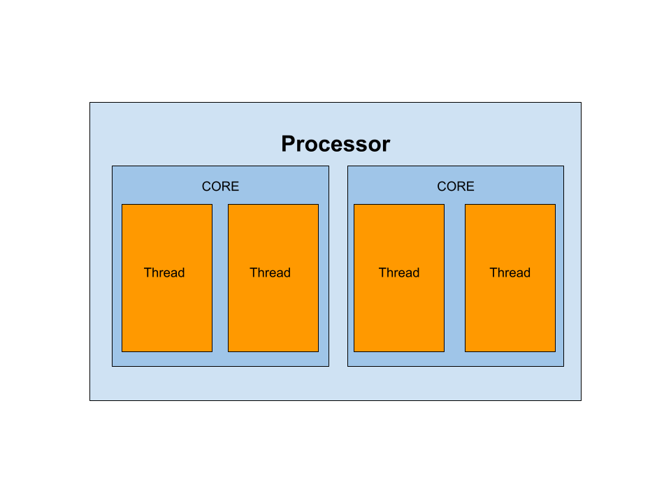

<style>
slides > slide {
  overflow-x: auto !important;
  overflow-y: auto !important;
}

.center {
  float: center;
}


</style>

```{r setup, include=FALSE}
knitr::opts_chunk$set(eval = FALSE)
```

## Outline  

- Introduction

- Parallel Processing in R

- Central Limit Theorem


# Introduction

## R

> - Software Environment
>    + Statiscal Computing
>    + Graphics
> - Cross-platform
>    + Mac, Windows, and Linux
> - R Packages
>    + Extends the functionality of R
> - Single-threaded

## Computer

 - Basic Components

    - Processor
  
    - RAM
  
    - Storage

## Processor-CPU

 - CPU
    + Where are processes in your computer occurs
    + Early processors only came with one cpu
    + Modern laptop processors contain more than 2-4 cpus
    + Modern cpus are multi-threaded
    
##  Processor Schematic   

<center>
{height=500}
</center>

## Multi-threading


# Parallel Processing in R

## How to parallelize your R Code

- `mclapply()`

  - Recommended for the cluster
  
  - Has built-in `try()` function
  
  - Replace any `lapply()` with `mclapply()` and add `mc.cores=` argument.

- `parLapply()`

  - Use if multiple nodes are involved
  
  - Use if on Windows PC

## Where to parallelize?

- Identify loops or *apply functions

  - Iterations must be independent of each other
  
- Identify bottlenecks

  - Use benchmark R packages
  
## How to speed up you R Code?

- Vectorize your R code

- Minimize loops

  - Use `*apply` functions 

- Use optimized functions

  - `colMeans()` and `rowMeans()`
  
- Implement c++ via Rcpp

- More Information: Advanced R ([adv-r.hadley.nz](https://adv-r.hadley.nz/)) 

## Anatomy of R Script

```{r}
# Load libraries and functions
library(parallel)

# Pre - Parallel Analysis

# Parallel Analysis
results <- mclapply(data, FUN, mc.cores = number_of_cores)

# Post - Parallel Analysis

# Save Results
file_name <- paste("Results_", date_time, ".RData",sep = "")
save(results, file = file_name, version = 2)
```


# Central Limt Theorem

## Central Limit Theorem


# Simulation Study

## Simulation Study

- Visually show the central limit theorem.

- Scenario 1:
  - $X \sim N(5, 8)$
  - $\bar X \sim N(5, \frac{8}{n})$

- Scenario 2:
  - $X \sim Pois(2)$
  - $\bar X \sim N(2, \frac{2}{n})$

- Scenario 3:
  - $X \sim Bin(30, 0.2)$
  - $\bar X \sim N(6, \frac{4.8}{n})$

## Simulation Parameters

- Number of Data sets: 10000

- Number of Observations: 100


## Parallelization of Simulation

- Identify the number of cores in your computer

- [R Script](https://inqs.info/present/hiss_2021_1.R)


## Executing Simulation Study

1. Download Script in R Console

      1. Type: `download.file("https://inqs.info/present/hiss_2021_1.R", "Parallel_Job.R")`

2. Identify the number of cores in your computer
      
      1. Type: `parallel::detectCores()`
 
# Thank You!

## Resources

More information of parallel processing:

[Link](https://ucrgradstat.github.io/stat_comp/hpcc/parallel_notebook.nb.html)

GSA Statistical Computing Website

[ucrgradstat.github.io/stat_comp](https://ucrgradstat.github.io/stat_comp/)


